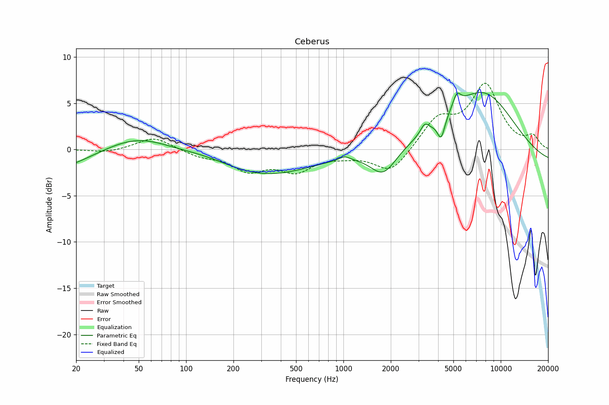

# Ceberus
See [usage instructions](https://github.com/jaakkopasanen/AutoEq#usage) for more options and info.

### Parametric EQs
In case of using parametric equalizer, apply preamp of **-6.8dB** and build filters manually
with these parameters. The first 5 filters can be used independently.
When using independent subset of filters, apply preamp of **-6.8 dB**.

| Type    | Fc       |    Q | Gain    |
|:--------|:---------|:-----|:--------|
| Peaking | 19 Hz    | 0.95 | -2.1 dB |
| Peaking | 49 Hz    | 0.58 | 1.6 dB  |
| Peaking | 335 Hz   | 0.49 | -2.7 dB |
| Peaking | 1768 Hz  | 1.8  | -2.8 dB |
| Peaking | 7738 Hz  | 0.65 | 6.7 dB  |
| Peaking | 671 Hz   | 3.3  | -0.4 dB |
| Peaking | 1003 Hz  | 5.73 | 0.7 dB  |
| Peaking | 12142 Hz | 2.05 | 1.9 dB  |
| Peaking | 19802 Hz | 0.59 | -6.0 dB |

### Fixed Band EQs
In case of using fixed band (also called graphic) equalizer, apply preamp of **-8.2dB**
(if available) and set gains manually with these parameters.

| Type    | Fc       |    Q | Gain    |
|:--------|:---------|:-----|:--------|
| Peaking | 31 Hz    | 1.41 | -0.3 dB |
| Peaking | 63 Hz    | 1.41 | 1.3 dB  |
| Peaking | 125 Hz   | 1.41 | -0.5 dB |
| Peaking | 250 Hz   | 1.41 | -2.2 dB |
| Peaking | 500 Hz   | 1.41 | -2.1 dB |
| Peaking | 1000 Hz  | 1.41 | -0.5 dB |
| Peaking | 2000 Hz  | 1.41 | -2.4 dB |
| Peaking | 4000 Hz  | 1.41 | 2.7 dB  |
| Peaking | 8000 Hz  | 1.41 | 7.7 dB  |
| Peaking | 16000 Hz | 1.41 | -0.4 dB |

### Graphs
