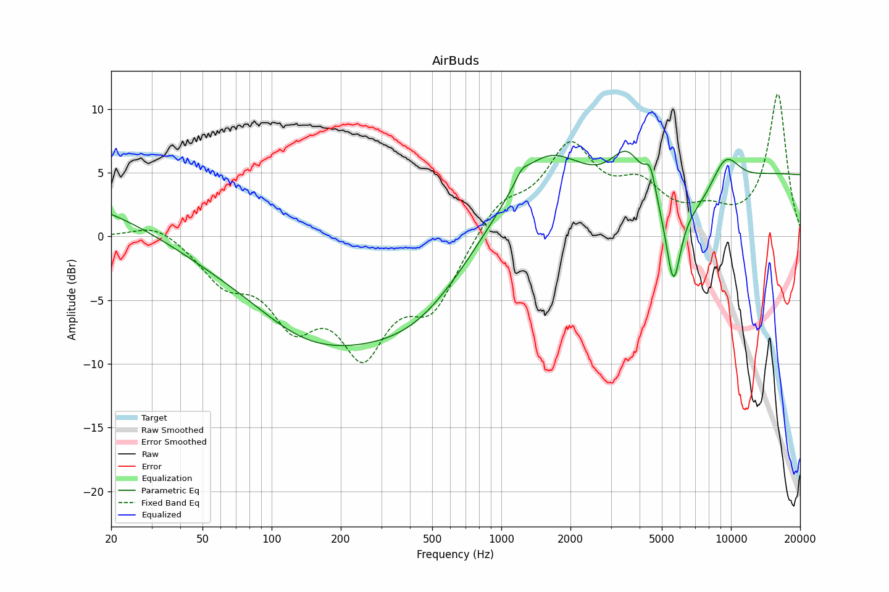

# AirBuds
See [usage instructions](https://github.com/jaakkopasanen/AutoEq#usage) for more options and info.

### Parametric EQs
In case of using parametric equalizer, apply preamp of **-7.0dB** and build filters manually
with these parameters. The first 5 filters can be used independently.
When using independent subset of filters, apply preamp of **-7.0 dB**.

| Type    | Fc       |    Q | Gain    |
|:--------|:---------|:-----|:--------|
| Peaking | 17 Hz    | 0.37 | 2.5 dB  |
| Peaking | 94 Hz    | 0.44 | -3.1 dB |
| Peaking | 310 Hz   | 0.38 | -8.1 dB |
| Peaking | 1678 Hz  | 0.57 | 8.3 dB  |
| Peaking | 13707 Hz | 0.71 | 6.6 dB  |
| Peaking | 1253 Hz  | 5.34 | 1.3 dB  |
| Peaking | 1912 Hz  | 1.92 | -1.1 dB |
| Peaking | 4303 Hz  | 1.82 | 3.9 dB  |
| Peaking | 5539 Hz  | 3.49 | -7.9 dB |
| Peaking | 9260 Hz  | 3.23 | 2.1 dB  |

### Fixed Band EQs
In case of using fixed band (also called graphic) equalizer, apply preamp of **-8.3dB**
(if available) and set gains manually with these parameters.

| Type    | Fc       |    Q | Gain    |
|:--------|:---------|:-----|:--------|
| Peaking | 31 Hz    | 1.41 | 1.4 dB  |
| Peaking | 63 Hz    | 1.41 | -3.0 dB |
| Peaking | 125 Hz   | 1.41 | -6.0 dB |
| Peaking | 250 Hz   | 1.41 | -7.7 dB |
| Peaking | 500 Hz   | 1.41 | -5.2 dB |
| Peaking | 1000 Hz  | 1.41 | 2.7 dB  |
| Peaking | 2000 Hz  | 1.41 | 6.6 dB  |
| Peaking | 4000 Hz  | 1.41 | 2.9 dB  |
| Peaking | 8000 Hz  | 1.41 | 2.8 dB  |
| Peaking | 16000 Hz | 1.41 | 7.9 dB  |

### Graphs
