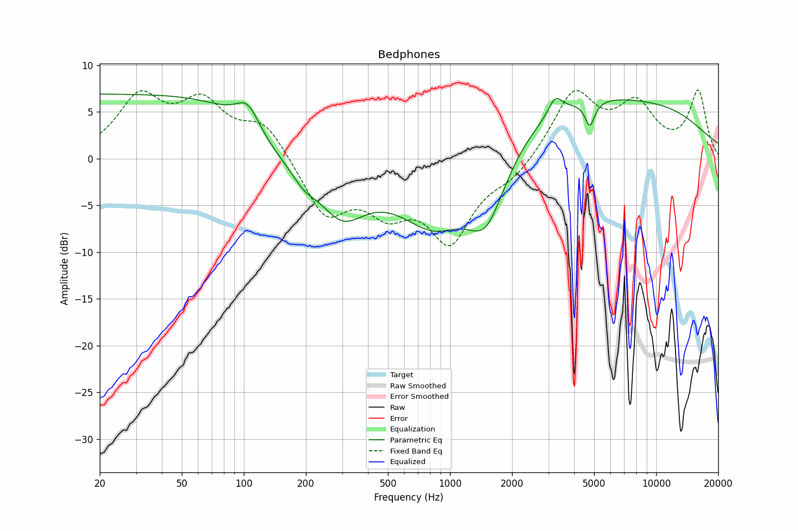

# Bedphones
See [usage instructions](https://github.com/jaakkopasanen/AutoEq#usage) for more options and info.

### Parametric EQs
In case of using parametric equalizer, apply preamp of **-6.7dB** and build filters manually
with these parameters. The first 5 filters can be used independently.
When using independent subset of filters, apply preamp of **-6.8 dB**.

| Type    | Fc       |    Q | Gain    |
|:--------|:---------|:-----|:--------|
| Peaking | 64 Hz    | 0.22 | 7.4 dB  |
| Peaking | 251 Hz   | 0.81 | -8.6 dB |
| Peaking | 1290 Hz  | 0.47 | -9.9 dB |
| Peaking | 3025 Hz  | 0.98 | 9.2 dB  |
| Peaking | 10127 Hz | 0.46 | 6.4 dB  |
| Peaking | 17 Hz    | 0.9  | 1.2 dB  |
| Peaking | 41 Hz    | 0.84 | -1.0 dB |
| Peaking | 101 Hz   | 2.56 | 1.9 dB  |
| Peaking | 166 Hz   | 1.68 | -0.9 dB |
| Peaking | 263 Hz   | 3.84 | 0.8 dB  |

### Fixed Band EQs
In case of using fixed band (also called graphic) equalizer, apply preamp of **-7.6dB**
(if available) and set gains manually with these parameters.

| Type    | Fc       |    Q | Gain    |
|:--------|:---------|:-----|:--------|
| Peaking | 31 Hz    | 1.41 | 6.2 dB  |
| Peaking | 63 Hz    | 1.41 | 5.3 dB  |
| Peaking | 125 Hz   | 1.41 | 3.7 dB  |
| Peaking | 250 Hz   | 1.41 | -6.2 dB |
| Peaking | 500 Hz   | 1.41 | -4.1 dB |
| Peaking | 1000 Hz  | 1.41 | -8.4 dB |
| Peaking | 2000 Hz  | 1.41 | -1.6 dB |
| Peaking | 4000 Hz  | 1.41 | 6.5 dB  |
| Peaking | 8000 Hz  | 1.41 | 6.3 dB  |
| Peaking | 16000 Hz | 1.41 | 5.4 dB  |

### Graphs
