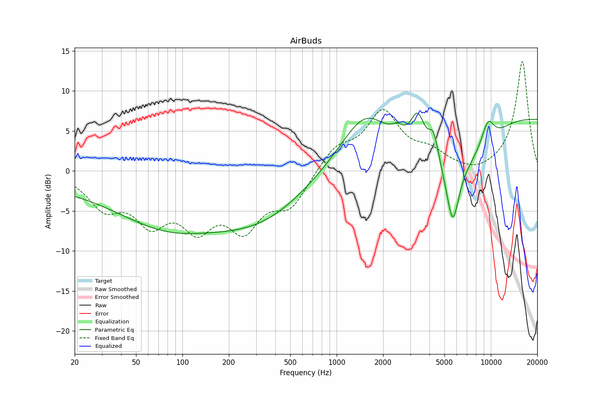

# AirBuds
See [usage instructions](https://github.com/jaakkopasanen/AutoEq#usage) for more options and info.

### Parametric EQs
In case of using parametric equalizer, apply preamp of **-6.5dB** and build filters manually
with these parameters. The first 5 filters can be used independently.
When using independent subset of filters, apply preamp of **-6.9 dB**.

| Type    | Fc       |    Q | Gain     |
|:--------|:---------|:-----|:---------|
| Peaking | 117 Hz   | 0.23 | -7.6 dB  |
| Peaking | 811 Hz   | 0.51 | -6.8 dB  |
| Peaking | 1147 Hz  | 0.54 | 9.2 dB   |
| Peaking | 5820 Hz  | 2.39 | -12.5 dB |
| Peaking | 12611 Hz | 0.08 | 6.4 dB   |
| Peaking | 833 Hz   | 2.77 | -0.3 dB  |
| Peaking | 2289 Hz  | 1.66 | -0.7 dB  |
| Peaking | 3868 Hz  | 4.1  | 1.6 dB   |
| Peaking | 7817 Hz  | 4.09 | -1.6 dB  |
| Peaking | 9601 Hz  | 3.3  | 1.0 dB   |

### Fixed Band EQs
In case of using fixed band (also called graphic) equalizer, apply preamp of **-10.3dB**
(if available) and set gains manually with these parameters.

| Type    | Fc       |    Q | Gain    |
|:--------|:---------|:-----|:--------|
| Peaking | 31 Hz    | 1.41 | -4.0 dB |
| Peaking | 63 Hz    | 1.41 | -5.4 dB |
| Peaking | 125 Hz   | 1.41 | -6.3 dB |
| Peaking | 250 Hz   | 1.41 | -5.9 dB |
| Peaking | 500 Hz   | 1.41 | -4.1 dB |
| Peaking | 1000 Hz  | 1.41 | 2.9 dB  |
| Peaking | 2000 Hz  | 1.41 | 7.0 dB  |
| Peaking | 4000 Hz  | 1.41 | 1.7 dB  |
| Peaking | 8000 Hz  | 1.41 | 0.7 dB  |
| Peaking | 16000 Hz | 1.41 | 10.0 dB |

### Graphs
