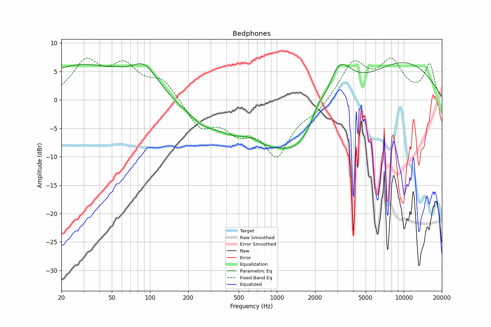

# Bedphones
See [usage instructions](https://github.com/jaakkopasanen/AutoEq#usage) for more options and info.

### Parametric EQs
In case of using parametric equalizer, apply preamp of **-6.9dB** and build filters manually
with these parameters. The first 5 filters can be used independently.
When using independent subset of filters, apply preamp of **-6.9 dB**.

| Type    | Fc       |    Q | Gain    |
|:--------|:---------|:-----|:--------|
| Peaking | 55 Hz    | 0.28 | 7.5 dB  |
| Peaking | 979 Hz   | 0.18 | -9.4 dB |
| Peaking | 3081 Hz  | 1.37 | 9.9 dB  |
| Peaking | 6880 Hz  | 0.59 | 7.7 dB  |
| Peaking | 14156 Hz | 1.09 | 4.4 dB  |
| Peaking | 97 Hz    | 4.5  | 1.8 dB  |
| Peaking | 600 Hz   | 2.39 | 1.6 dB  |
| Peaking | 1506 Hz  | 1.3  | -2.4 dB |
| Peaking | 2226 Hz  | 1.5  | 2.8 dB  |
| Peaking | 2762 Hz  | 3.56 | -1.8 dB |

### Fixed Band EQs
In case of using fixed band (also called graphic) equalizer, apply preamp of **-7.6dB**
(if available) and set gains manually with these parameters.

| Type    | Fc       |    Q | Gain    |
|:--------|:---------|:-----|:--------|
| Peaking | 31 Hz    | 1.41 | 6.1 dB  |
| Peaking | 63 Hz    | 1.41 | 5.3 dB  |
| Peaking | 125 Hz   | 1.41 | 3.5 dB  |
| Peaking | 250 Hz   | 1.41 | -4.6 dB |
| Peaking | 500 Hz   | 1.41 | -4.3 dB |
| Peaking | 1000 Hz  | 1.41 | -9.1 dB |
| Peaking | 2000 Hz  | 1.41 | -1.8 dB |
| Peaking | 4000 Hz  | 1.41 | 6.5 dB  |
| Peaking | 8000 Hz  | 1.41 | 6.2 dB  |
| Peaking | 16000 Hz | 1.41 | 6.0 dB  |

### Graphs
