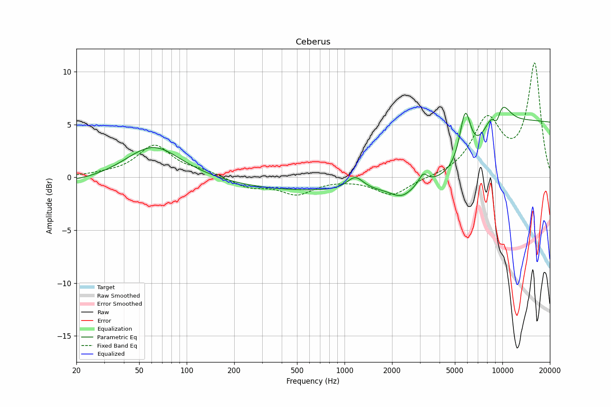

# Ceberus
See [usage instructions](https://github.com/jaakkopasanen/AutoEq#usage) for more options and info.

### Parametric EQs
In case of using parametric equalizer, apply preamp of **-6.1dB** and build filters manually
with these parameters. The first 5 filters can be used independently.
When using independent subset of filters, apply preamp of **-6.1 dB**.

| Type    | Fc       |    Q | Gain    |
|:--------|:---------|:-----|:--------|
| Peaking | 62 Hz    | 0.56 | 4.8 dB  |
| Peaking | 75 Hz    | 0.11 | -2.0 dB |
| Peaking | 3401 Hz  | 0.66 | -4.0 dB |
| Peaking | 6310 Hz  | 0.49 | 4.6 dB  |
| Peaking | 16788 Hz | 0.29 | 5.1 dB  |
| Peaking | 1158 Hz  | 4.98 | 0.8 dB  |
| Peaking | 3327 Hz  | 4.26 | 2.5 dB  |
| Peaking | 4184 Hz  | 1.93 | -2.8 dB |
| Peaking | 5794 Hz  | 2.47 | 3.4 dB  |
| Peaking | 7069 Hz  | 5.04 | -3.0 dB |

### Fixed Band EQs
In case of using fixed band (also called graphic) equalizer, apply preamp of **-8.9dB**
(if available) and set gains manually with these parameters.

| Type    | Fc       |    Q | Gain    |
|:--------|:---------|:-----|:--------|
| Peaking | 31 Hz    | 1.41 | 0.3 dB  |
| Peaking | 63 Hz    | 1.41 | 3.1 dB  |
| Peaking | 125 Hz   | 1.41 | 0.4 dB  |
| Peaking | 250 Hz   | 1.41 | -1.0 dB |
| Peaking | 500 Hz   | 1.41 | -1.3 dB |
| Peaking | 1000 Hz  | 1.41 | -0.1 dB |
| Peaking | 2000 Hz  | 1.41 | -1.7 dB |
| Peaking | 4000 Hz  | 1.41 | -0.3 dB |
| Peaking | 8000 Hz  | 1.41 | 6.2 dB  |
| Peaking | 16000 Hz | 1.41 | 8.4 dB  |

### Graphs
