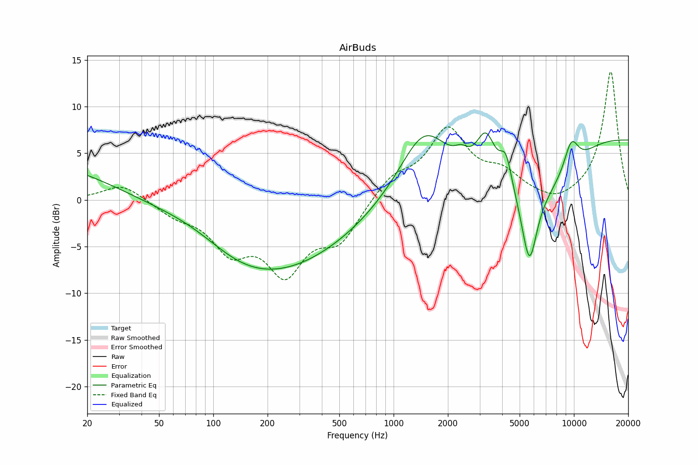

# AirBuds
See [usage instructions](https://github.com/jaakkopasanen/AutoEq#usage) for more options and info.

### Parametric EQs
In case of using parametric equalizer, apply preamp of **-7.4dB** and build filters manually
with these parameters. The first 5 filters can be used independently.
When using independent subset of filters, apply preamp of **-7.3 dB**.

| Type    | Fc       |    Q | Gain     |
|:--------|:---------|:-----|:---------|
| Peaking | 15 Hz    | 0.63 | 3.3 dB   |
| Peaking | 142 Hz   | 1.01 | -1.6 dB  |
| Peaking | 271 Hz   | 0.39 | -7.0 dB  |
| Peaking | 1674 Hz  | 0.73 | 8.0 dB   |
| Peaking | 16821 Hz | 0.46 | 7.1 dB   |
| Peaking | 1213 Hz  | 6.87 | 2.2 dB   |
| Peaking | 1796 Hz  | 1.64 | -1.4 dB  |
| Peaking | 3915 Hz  | 1.54 | 5.0 dB   |
| Peaking | 5630 Hz  | 2.48 | -10.1 dB |
| Peaking | 10031 Hz | 2.12 | 3.5 dB   |

### Fixed Band EQs
In case of using fixed band (also called graphic) equalizer, apply preamp of **-10.3dB**
(if available) and set gains manually with these parameters.

| Type    | Fc       |    Q | Gain    |
|:--------|:---------|:-----|:--------|
| Peaking | 31 Hz    | 1.41 | 2.0 dB  |
| Peaking | 63 Hz    | 1.41 | -1.2 dB |
| Peaking | 125 Hz   | 1.41 | -5.2 dB |
| Peaking | 250 Hz   | 1.41 | -6.5 dB |
| Peaking | 500 Hz   | 1.41 | -4.3 dB |
| Peaking | 1000 Hz  | 1.41 | 2.7 dB  |
| Peaking | 2000 Hz  | 1.41 | 7.1 dB  |
| Peaking | 4000 Hz  | 1.41 | 1.5 dB  |
| Peaking | 8000 Hz  | 1.41 | 0.4 dB  |
| Peaking | 16000 Hz | 1.41 | 10.0 dB |

### Graphs
