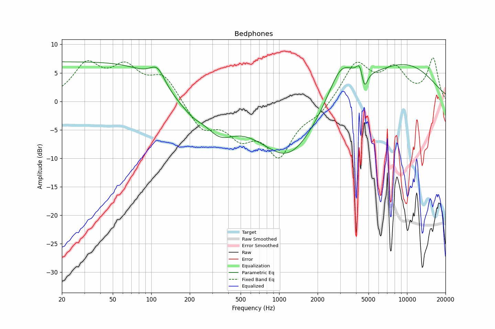

# Bedphones
See [usage instructions](https://github.com/jaakkopasanen/AutoEq#usage) for more options and info.

### Parametric EQs
You can use filters 1-5 or 1-10. Apply preamp of -7.0 dB or -7.0 dB, respectively.

|   # | Type      |   Fc (Hz) |    Q |   Gain (dB) |
|-----|-----------|-----------|------|-------------|
|   1 | LowShelf  |       105 | 0.7  |         7   |
|   2 | Peaking   |       342 | 1.29 |        -3.8 |
|   3 | Peaking   |      1187 | 0.58 |       -10   |
|   4 | Peaking   |      3040 | 1.28 |         7.1 |
|   5 | Peaking   |      8708 | 0.44 |         6.1 |
|   6 | Peaking   |       112 | 2.29 |         3.5 |
|   7 | Peaking   |       211 | 1.96 |        -1.2 |
|   8 | Peaking   |      4260 | 5.97 |         2.2 |
|   9 | Peaking   |      4652 | 6    |        -3.1 |
|  10 | HighShelf |     10000 | 0.7  |         1   |

### Fixed Band EQs
When using fixed band (also called graphic) equalizer, apply preamp of **-7.7 dB** (if available) and set gains manually with these parameters.

|   # | Type    |   Fc (Hz) |    Q |   Gain (dB) |
|-----|---------|-----------|------|-------------|
|   1 | Peaking |        31 | 1.41 |         6   |
|   2 | Peaking |        62 | 1.41 |         5.2 |
|   3 | Peaking |       125 | 1.41 |         4.4 |
|   4 | Peaking |       250 | 1.41 |        -4.7 |
|   5 | Peaking |       500 | 1.41 |        -5   |
|   6 | Peaking |      1000 | 1.41 |        -8.8 |
|   7 | Peaking |      2000 | 1.41 |        -1.9 |
|   8 | Peaking |      4000 | 1.41 |         6.7 |
|   9 | Peaking |      8000 | 1.41 |         5.2 |
|  10 | Peaking |     16000 | 1.41 |         7.3 |

### Graphs

